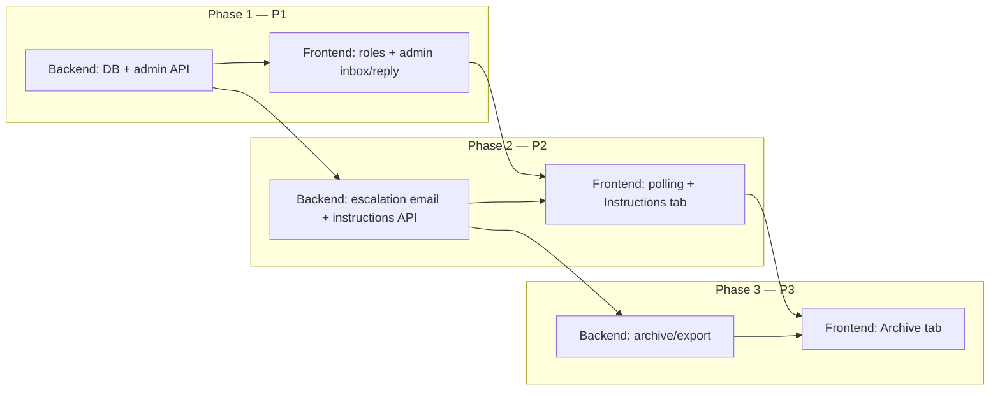

ok# Digital Twin 001 — Frontend adoption requirements

**Purpose:** Coordinated adoption plan between the **digital_twin** API (GCP / Cloud Run) and the **ak47.github.io** static frontend (`no_ego`). Ensures both repositories implement feature **001-conversation-persistence-admin** in lockstep.

**Backend spec (canonical behavior):** `digital_twin` repo → `specs/001-conversation-persistence-admin/spec.md`

**Status:** Draft — tracks spec 001 as of 2026-06-09

**Related:** [resume-bot-gcp-github-pages-plan.md](./resume-bot-gcp-github-pages-plan.md) (original About-widget architecture)

---

## 1. Summary of feature 001

| Priority | Capability | Visitor UI (`digital-twin-chat`) | Admin UI (new) |
|----------|------------|----------------------------------|----------------|
| **P1** | Durable message-level conversation history | Reload restores thread; conversation id in `localStorage` | — |
| **P1** | Three roles: visitor, twin, owner | Distinct styling for owner messages | Inbox + thread view |
| **P1** | Owner replies in live thread | Poll for owner messages | Compose owner reply, resolve |
| **P1** | Admin authentication (Google + email allowlist) | — | Google sign-in, logout, protected routes |
| **P2** | Escalation + owner email alert | — | Needs-attention indicators (backend emails owner; Pushover future) |
| **P2** | Tiered polling for new messages | Backoff ladder while chat open | — |
| **P2** | Additional instructions (settings row) | — | Instructions tab: Markdown editor + save |
| **P3** | Export + archive | — | Archive tab, download, bulk 72h archive |

**Out of scope for 001 (frontend):** FAQ database editor, web-fetch tool UI, `?m=` deep link, OG image.

---

## 2. Repository split

| Repo | Owns |
|------|------|
| **`digital_twin`** | API, durable storage, twin generation, admin API routes, escalation email delivery, additional-instructions persistence and prompt injection |
| **`ak47.github.io/no_ego`** | Visitor chat widget on About, new admin pages/routes, API client modules, build-time `GATSBY_DIGITAL_TWIN_API_BASE` |

Admin UI may ship as Gatsby pages under e.g. `/about/admin/` (or a dedicated path decided in `/speckit-plan`). Visitor chat stays on the existing About embed.

---

## 3. API contract (frontend expectations)

Exact paths may be finalized in the backend plan; the frontend SHOULD implement against these logical contracts.

### 3.1 Visitor (public) — largely backward compatible

| Method | Path | Purpose |
|--------|------|---------|
| `GET` | `/api/chat` or `/api/conversations/{id}` | Load full history (or migrate header to `conversation_id`) |
| `GET` | `/api/conversations/{id}?after={messageId}` | Incremental poll for owner/twin messages |
| `POST` | `/api/chat` | Send visitor message; SSE stream for twin reply |

**Headers**

- `X-Session-Id` today maps to **conversation id** (UUID). Keep `localStorage` key `digital_twin_session_id` unless renamed in a coordinated breaking change.
- Response continues to echo conversation id header on applicable routes.

**Message shape (target)**

```json
{
  "id": 42,
  "role": "visitor | twin | owner",
  "content": "markdown or plain text",
  "created_at": "ISO-8601"
}
```

Legacy `{ "role": "user|assistant", "text": "..." }` may be supported during migration; frontend should handle both until backend cutover is complete.

### 3.2 Admin (authenticated)

**Google account sign-in** with backend validation against a **hardcoded allowlist of email addresses**. Non-allowlisted Google accounts are rejected after OAuth (fail closed). Session is typically an httpOnly cookie issued only after allowlist check. All `/admin/*` routes return `401` without a valid session.

| Method | Path | Purpose |
|--------|------|---------|
| `GET` | `/admin/auth/google` or equivalent | Start Google OAuth redirect |
| `GET` | `/admin/auth/google/callback` or equivalent | Complete OAuth; verify email on allowlist; set session cookie |
| `POST` | `/admin/logout` | Clears session |
| `GET` | `/admin/me` | `200` with `{ "email": "..." }` if authenticated and allowlisted |
| `GET` | `/admin/conversations` | Inbox summaries |
| `GET` | `/admin/conversations/{id}` | Full thread; marks read / clears attention |
| `POST` | `/admin/conversations/{id}/messages` | Owner reply `{ "content": "..." }` |
| `POST` | `/admin/conversations/{id}/resolve` | Clear needs-attention |
| `GET` | `/admin/instructions` | Current additional-instructions Markdown (may be empty string) |
| `PUT` | `/admin/instructions` | Save `{ "content": "..." }` (Markdown) |

**P3 (defer frontend until backend ready)**

| Method | Path | Purpose |
|--------|------|---------|
| `GET` | `/admin/conversations/export` | Download JSONL |
| `GET` | `/admin/archive` | Archived inbox |
| `POST` | `/admin/conversations/{id}/archive` | Archive thread |
| `POST` | `/admin/archive/{id}/restore` | Restore thread |
| `POST` | `/admin/archive/bulk` | Bulk archive idle > 72h |

**CORS:** Admin routes require `credentials: 'include'` from allowed origins. Backend must set `allow_credentials=True` for admin cookie flows (constitution/plan item).

---

## 4. Visitor UI requirements (`no_ego`)

**Files (today):** `src/components/digital-twin-chat.js`, `src/utils/digitalTwinApi.js`

### 4.1 P1 — History and roles

- [ ] Persist conversation id from response header (existing behavior).
- [ ] Optional visitor name: if collected in UI, send `visitor_name` on POST `/api/chat`; if omitted, backend defaults inbox label to **"Rando"** until a name is provided later.
- [ ] On mount, load full thread via GET; map roles to UI:
  - `visitor` / `user` → user bubble
  - `twin` / `assistant` → assistant bubble
  - `owner` / `human` → **distinct owner bubble** (label e.g. "Andy" or "Owner", not the twin)
- [ ] Include monotonic `id` on each message client-side for poll cursor.

### 4.2 P2 — Polling

Implement tiered backoff while the chat component is mounted (from docs/MORE.md §12):

| Condition since last received message | Poll interval |
|---------------------------------------|---------------|
| Active (default) | 10 seconds |
| ≥ 2 minutes idle | 30 seconds |
| ≥ 10 minutes idle | 2 minutes |
| ≥ 1 hour idle | 5 minutes |

- [ ] Reset to 10s tier on visitor send **or** on receiving a new owner/twin message.
- [ ] Poll `GET ...?after={lastId}`; append new rows without duplicating.
- [ ] Do not poll when `apiBase` unset or conversation id missing.

### 4.3 Non-goals (visitor)

- No additional-instructions editor on the public page.
- No admin auth on GitHub Pages visitor routes.
- No password form; admin uses **Sign in with Google** only.

---

## 5. Admin UI requirements (new in `no_ego`)

### 5.1 Routing and access

- [ ] New Gatsby page(s) for admin (path TBD in plan; e.g. `/digital-twin-admin/`).
- [ ] **Sign in with Google** button → OAuth flow via backend (redirect or popup per plan).
- [ ] Gate all admin views on `GET /admin/me` (`credentials: 'include'`).
- [ ] Show clear error when Google account is not on the allowlist (no admin session).
- [ ] Do not embed OAuth client secrets in static build; only public client id if required by chosen flow.

### 5.2 Main navigation (horizontal tab strip) — **FR-022a owner: frontend**

Implement once in a shared layout component (e.g. `src/components/digital-twin-admin-layout.js`) used by all admin pages. Backend does not serve admin HTML.

Shared app bar across admin views, responsive on mobile:

```
Conversations | Instructions | Archive
```

- **Conversations** — P1 (default landing tab after login)
- **Instructions** — P2
- **Archive** — P3 (hide tab or show disabled/“coming soon” until backend ships)

Each tab is a separate Gatsby page/route wrapped by the same layout (login gate + nav).

### 5.3 Conversations tab (P1)

- [ ] Table/list: preview, name, last activity, message count, unread, needs-attention badge.
- [ ] Sort: most recent first.
- [ ] Thread view: full transcript with role labels and timestamps.
- [ ] Actions: **Reply** (owner message), **Mark resolved** (clear attention).
- [ ] Total conversation count near top (P3 adds download button on same header pattern).

### 5.4 Instructions tab (P2)

- [ ] On load: `GET /admin/instructions` → populate textarea (empty state copy if blank).
- [ ] Freeform **Markdown** editor (textarea acceptable for v1; preview optional).
- [ ] **Save** → `PUT /admin/instructions` with full document body.
- [ ] Success/error toast or inline message.
- [ ] Help text: changes apply to the **next** visitor message; no redeploy needed.
- [ ] No visitor-visible exposure of draft until saved.

### 5.5 Archive tab (P3)

- [ ] Mirror Conversations list UX for archived threads.
- [ ] Restore action per thread.
- [ ] **Archive** on active thread (from Conversations detail).
- [ ] **Archive all** with no activity 72h (confirm dialog).
- [ ] **Download** JSONL on Conversations and Archive pages.

---

## 6. API client module (`digitalTwinApi.js`)

Extend or split modules:

| Export | Phase | Responsibility |
|--------|-------|----------------|
| `loadChatHistory` | P1 | GET full thread |
| `pollMessages(apiBase, conversationId, afterId)` | P2 | GET incremental |
| `sendChatPrompt` | P1 | POST SSE (unchanged flow) |
| `adminGoogleSignIn`, `adminLogout`, `adminMe` | P1 | Google OAuth + session cookie |
| `adminListConversations`, `adminGetConversation`, `adminPostReply`, `adminResolve` | P1 | Inbox |
| `adminGetInstructions`, `adminSaveInstructions` | P2 | Settings row |
| `adminExport`, `adminArchive*`, `adminRestore` | P3 | Archive/export |

All admin fetch calls: `credentials: 'include'`.

---

## 7. Phased rollout (coordination)



| Phase | Backend merge criteria | Frontend merge criteria | Joint smoke test |
|-------|------------------------|-------------------------|------------------|
| **1** | Messages persist; admin CRUD; Google auth + allowlist | Google sign-in; inbox; owner reply visible after manual refresh | Allowlisted owner reply appears in thread after reload |
| **2** | Instructions GET/PUT; fresh inject per turn; escalation flags | Polling shows owner reply < 15s; Instructions save changes twin behavior | Edit instructions → new visitor question reflects edit |
| **3** | Archive/export endpoints | Archive tab + download | Archive thread → gone from active → restore |

**Deploy order:** Backend Phase 1 should reach production (or staging) before frontend enables admin routes. Visitor widget can ship role + poll changes behind feature detection (e.g. presence of `id` on messages) if needed.

---

## 8. Environment and build

| Variable | Where | Purpose |
|----------|-------|---------|
| `GATSBY_DIGITAL_TWIN_API_BASE` | GitHub Actions / local `no_ego` | API origin, no trailing slash |
| `ADMIN_ALLOWED_EMAILS` | Backend config (hardcoded allowlist) | Never in frontend |
| Google OAuth client id/secret | Cloud Run / Secret Manager (backend) | Public client id only if required in browser |

Production default API base (existing): `https://digital-twin.no-ego.net`

---

## 9. Acceptance checklist (frontend repo)

### P1

- [ ] Allowlisted Google account can sign in and see conversation list from production/staging API.
- [ ] Non-allowlisted Google account is denied after sign-in with a clear message.
- [ ] Owner can post reply; message stored with owner role.
- [ ] Visitor chat shows owner message with distinct styling after reload (poll in P2).

### P2

- [ ] Polling delivers owner reply without full page reload within 15s active tier.
- [ ] Instructions tab loads, saves, and survives reload.
- [ ] Twin behavior changes after instruction save (validated manually against API).

### P3

- [ ] Archive and restore change active vs archive lists correctly.
- [ ] JSONL download opens valid JSON lines locally.

---

## 10. Open decisions (resolve in `/speckit-plan`)

1. **Admin URL path** on GitHub Pages (single page app vs multiple Gatsby pages).
2. **CORS credentials** — update Terraform `cors_allowed_origins` and FastAPI `allow_credentials` for admin cookies.
3. **Breaking change window** for `GET /api/chat` message shape vs new `/api/conversations/{id}` route.
4. **Owner display name** in visitor UI (hardcode, env var, or `GET /` metadata).

---

## 11. Changelog

| Date | Change |
|------|--------|
| 2026-06-09 | Initial document; aligns with digital_twin spec 001 including additional instructions (P2). |
| 2026-06-09 | Admin auth: Google sign-in + hardcoded email allowlist (replaces password). |
| 2026-06-09 | Escalation alerts via email; Pushover push deferred to future. |
| 2026-06-09 | Admin nav (FR-022a) owned by shared frontend layout; visitor default name "Rando". |
