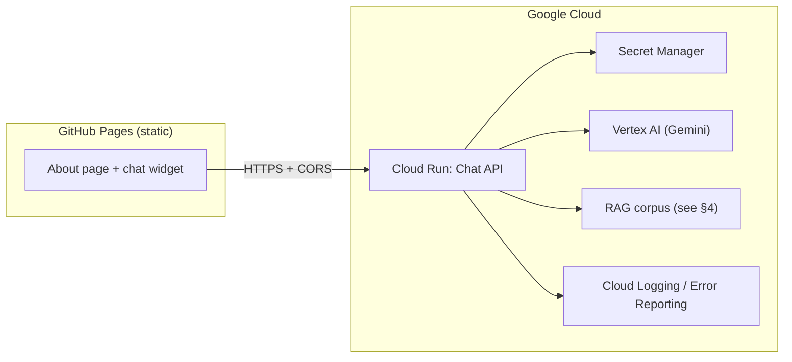

# Resume / career chatbot — GCP rebuild + GitHub Pages (About section)

**Purpose:** Alignment document for rebuilding the GenAI bootcamp “digital twin” capstone on Google Cloud, with the user-facing UI embedded in the static **ak47.github.io / no-ego** GitHub Pages site under **About**—not a Python-generated site.

**Canonical location:** This file in the **ak47.github.io** repo: `docs/resume-bot-gcp-github-pages-plan.md`.

**Status:** Decisions captured inline; execution plan and follow-ups in **§12–§14** (synced by assistant).

---

## 1. What the bootcamp project actually was (review summary)

After reviewing `references/ai_bootcamp`, the closest match to a “resume-bot” is the **digital twin** track (e.g. `genai-bootcamp/week8/1-admin-ui/twin/` and `week7/2-digital-twin-revisited/`):

| Piece | Bootcamp implementation |
|--------|-------------------------|
| **UX goal** | Prospective employers chat with a “digital twin” that answers **career / work-history** questions (`twin/frontend/src/prompt.md`). |
| **Backend** | **FastAPI** on AWS Lambda (Function URL): `POST /api/chat` (SSE stream), `GET /api/chat` (load history), cookie-based `session_id`. |
| **Model** | **Amazon Bedrock** (e.g. Claude Haiku) via **Strands** `BedrockModel`. |
| **RAG** | **Strands** `retrieve` tool + **Bedrock Knowledge Base** backed by **S3 Vectors** (ingestion pipeline in the `kb/` CDK stacks). |
| **Session state** | **S3** via `S3SessionManager` (conversation persisted per session). |
| **Frontend** | Separate admin/static chat UI (not GitHub Pages in the course repo). |

The **alumni NY Crashes** project in the same tree is a different capstone (SQL + collision data); it is **not** the resume twin.

**Implication for rebuild:** Preserve the **behavior contract** (streaming chat, RAG over your career corpus, session continuity) while swapping **AWS → GCP** and **hosted UI → embedded widget on GitHub Pages**.

---

## 2. Project goals (proposed — please edit)

1. **Primary:** Visitors on your **About** page can ask natural-language questions about your work history; answers are **grounded** in curated content you control (resume, project blurbs, optional private notes you choose to include in the corpus).
2. **Platform:** Backend runs on **GCP** (similar operational style to `fin_report_summarizer`: Cloud Run, secrets in Secret Manager, CI deploys, observability).
3. **Frontend:** **GitHub Pages** static site only—no server-side rendering requirement. Chat is a **small embedded client** (vanilla JS or a minimal React island) that talks to your API.
4. **Quality bar:** Reasonable **latency**, **streaming** replies, basic **abuse protection** (rate limits / quotas), and clear **disclaimer** that this is an AI-assisted overview, not a legal attestation.
5. **Non-goals (unless you promote them):** Full CRM, user accounts, or storing visitor PII beyond what’s needed for session continuity.

---

## 3. Target architecture (high level)

- **GitHub Pages:** Serves HTML/JS/CSS; **no API keys** for Vertex in the browser.
- **Cloud Run:** Single service (or two if you split “ingestion” from “chat”) with service account access to Vertex and your vector/RAG store.
- **fin_report_summarizer parallel:** Same ideas—**Cloud Run**, **Workload Identity Federation** or deploy keys from GitHub Actions, **Secret Manager** for model/config secrets, optional **Cloud Scheduler** only if you add periodic re-embedding jobs.

---

## 4. RAG / knowledge options on GCP (decision point)

Pick **one** primary approach (can evolve later):

| Option | Pros | Cons |
|--------|------|------|
| **A. Vertex AI RAG Engine** (corpus in GCS or supported sources) | Managed retrieval, fits “production” story, one vendor stack | Setup + pricing learning curve; corpus update workflow to define |
| **B. Firestore / AlloyDB + vector search** | Flexible; good if you already use Firestore | More app code for chunking, embedding jobs, and query |
| **C. Vertex AI Search** (enterprise search) | Strong for document search UIs | May be heavier than needed for a personal resume corpus |
| **D. “Light RAG”** (embeddings API + small vector DB on Cloud Run sidecar or managed Matching Engine) | Maximum control | More moving parts than A |

**Recommendation for v1:** **Option A (Vertex RAG)** or **Option D simplified** (batch job: chunk markdown → embed → store in a **single** managed index you query from Cloud Run) if you want minimal GCP console surface.

>> I want option A

**Corpus source:** Version-controlled **Markdown/YAML** in a **private** repo or **GCS bucket** (not the public Pages repo), ingested by CI or a manual “publish knowledge” workflow—so your public site never ships raw private notes.

>> I created /Users/andy/werk/my_gits/projects/digital_twin for this new project, it has a github mirror set up

---

## 5. Backend API design (compatibility with bootcamp + static site)

Mirror the bootcamp contract where it helps:

| Endpoint | Behavior |
|----------|----------|
| `POST /api/chat` | Body: `{ "prompt": "..." }`. Response: **SSE** (`text/event-stream`) streaming tokens/events (same UX idea as Strands stream). |
| `GET /api/chat` | Optional: return recent messages for session restore (JSON), keyed by **HttpOnly cookie** or explicit `session_id` + server-side store. |

**Session storage (replace S3):**

- **Firestore** document per `session_id`, or  
- **Cloud Storage** JSON blobs (closer to bootcamp), or  
- **Redis (Memorystore)** if you want TTL and fast eviction.

>> **Cloud Storage** JSON blobs is sufficient, this doesn't need to be very fast, but i do want it to be low cost so I can leave it operational where it will be dormant most of the time

**Model:** **Gemini** via Vertex AI (aligns with `fin_report_summarizer`). System prompt lives in repo (like your `V2/prompts/` pattern) for SME/you iteration.

**CORS:** Cloud Run response headers must allow your **GitHub Pages origin** (and custom domain if used).

---

## 6. GitHub Pages integration (About section)

**Constraints:**

- Pages is **static**; the chat widget must call **your Cloud Run URL**.
- You will expose a **public** HTTPS endpoint; protect it with **rate limiting** (Cloud Armor, or application-level limits) and possibly a **signed short-lived token** issued by a tiny **Cloud Function**—only if you want to reduce drive-by scraping (optional complexity).

**Implementation sketch:**

1. Add a **dedicated section** on the About page: short intro + disclaimer + chat panel.
2. Load a small **`resume-chat.js`** (and CSS) from the same Pages build.
3. Config: `window.RESUME_CHAT_API_BASE = 'https://your-service-xxx.run.app'` (injected at build time via env in Gatsby/11ty/etc., or a single `config.js` generated in CI—**still no Vertex secrets**).
4. Reuse patterns from bootcamp **SSE client** (EventSource or `fetch` + ReadableStream).

>> Note: Is there any value in a custom DNS entry like "digital_twin.no-ego.net" for this project? Maybe not as it would be hidden behind the "www.no-ego.net" GHP site

**Repository layout options:**

- **Same repo** as the site: widget lives in `static/` or `src/components/ResumeChat/` (under `no_ego/` or whichever package builds the site).

>>  use /Users/andy/werk/my_gits/projects/digital_twin for the new project, I want the digital twin to be a private project, whereas the ak47 site is public.

- **Submodule or npm package:** only if you expect to reuse the widget elsewhere.

>> Not likely

---

## 7. Security, privacy, and abuse

| Topic | Plan |
|--------|------|
| **Secrets** | Vertex credentials via **service account** on Cloud Run; no keys in GitHub Pages. |
| **PII** | Do not log full prompts/responses by default; redact or sample for debugging. |
| **Rate limits** | Per-IP and/or global QPS caps; return `429` with retry-after. |
| **Content** | Corpus is **your** narrative; add guardrails (system prompt + optional safety settings) to refuse off-topic or harmful requests. |
| **Session fixation** | Issue session cookie on first visit; use secure, HttpOnly, SameSite=Lax (or Strict if compatible). |

>> definitely need to protect against AI session attackss, I don't want this AI access to be manipulated for alternative (nefarious) deeds

---

## 8. Observability and cost

- **Logging:** Structured logs (request id, session id hash, latency, token usage if available).
- **Metrics:** Request count, error rate, p95 latency; alert on error spikes.
- **Cost controls:** Budget alerts in GCP; cap `max_output_tokens`; consider **Gemini Flash** for cheap default with **Pro** only for “deep” mode if you add that later.

>> does google cloud have an effective metrics solution? or do I need something like a Grafana account?     

---

## 9. Implementation phases (suggested)

| Phase | Outcome |
|-------|---------|
| **0. Decisions** | Fix RAG option (§4), naming, custom domain for API vs `run.app`. |

> custtom domain, the aforementioned 'digital_twin.no-ego.net' would work

| **1. Corpus** | Finalize markdown sources; define chunking; one-time ingest to chosen store. |
| **2. API** | Cloud Run + FastAPI (or reuse bootcamp app structure minus Strands/Bedrock); Vertex Gemini + retrieve; SSE. |
| **3. Session** | Cookie + **GCS** JSON session blobs (3-day TTL, lifecycle rules); GET history. |
| **4. Widget** | Minimal UI on a **branch** of the Pages repo; CORS wired. |
| **5. CI/CD** | GitHub Actions: build container → push Artifact Registry → deploy Cloud Run (mirror fin_report_summarizer patterns). |
| **6. Hardening** | Rate limits, budgets, disclaimer copy, basic E2E test. |
| **7. Launch** | Merge About section; monitor. |

---

## 10. Open questions (for your comments)

1. **Branding:** Should the twin speak in **first person** (“I worked on…”) as in the bootcamp system prompt, or **third person** (“Andrew worked on…”) for clarity?

> third person, like a narrator of a life story

2. **Corpus scope:** Resume only, or also **blog posts / public repos / case studies**? Anything **must-not** appear in RAG?

> let's have a list of available resources and I will review

3. **Session length:** How long should conversations persist (hours / days / none for anonymous fresh sessions)?

> 3 days

4. **Authentication:** Truly public chat, or **optional** gate (e.g. “enter email to continue”—usually not worth it for a portfolio)?

> public chat, but bot protected

5. **Domain:** Will the Pages site use **`github.io`** only or **no-ego.net** custom domain? (Affects CORS and cookie `Domain`.)

> we can use the "no-ego.net" domain name, I can do configurations needed

6. **Repo home:** New repo `resume-chat-gcp` vs folder under existing personal site monorepo?

> use /Users/andy/werk/my_gits/projects/digital_twin

---

## 11. Suggested next step after you comment

Goals and open questions in **§10** are answered inline. Next: implement **§13** in repo `digital_twin` (private), then wire the public widget in **ak47.github.io** / **no-ego**.

---

## 12. Agreed decisions (synced from your inline comments)

| Topic | Decision |
|--------|-----------|
| **RAG** | **Vertex AI RAG Engine** (Option A); corpus ingested from sources you control (not shipped on public Pages). |
| **Backend / infra repo** | Private project: `/Users/andy/werk/my_gits/projects/digital_twin` (GitHub mirror). **ak47.github.io** stays public; only the **chat widget + static assets** live there. |
| **Session store** | **Cloud Storage** JSON per session; optimize for **low idle cost**; acceptable latency. **TTL: 3 days** (enforce in app + optional bucket lifecycle). |
| **API hostname** | **Custom domain** `digital_twin.no-ego.net` → Cloud Run (see §6 reply below). |
| **Branding** | **Third person** (“Andrew …”), narrator of a life story. |
| **Sessions / auth** | **Public** chat; **bot and API** hardened (rate limits, prompt boundaries, no general-purpose tools). |
| **Site / CORS** | User-facing site: **no-ego.net** (you’ll configure DNS / TLS as needed). |
| **Corpus** | You want a **reviewable list of resources** — draft seed list in **§14**; you mark keep/cut/add. |
| **Metrics** | Prefer **Google Cloud Monitoring** first (built-in dashboards, SLOs, alerts on Cloud Run / quotas). **Grafana** is optional if you later want one pane across GCP + non-GCP; not required for v1. |
| **Region** | **`us-central1`** for Cloud Run, GCS, and Vertex. |
| **Infrastructure as code** | **100% Terraform** in `digital_twin/terraform/` (APIs, buckets, RAG engine config tier, Artifact Registry, IAM, Cloud Run service, public invoker). **GCP project ID** is never committed: use `TF_VAR_project_id` or gitignored `terraform.tfvars` (`.env` is for local app only — see `digital_twin` README). |
| **Rate limiting** | **App-level** first (no Cloud Armor requirement for v1). |
| **RAG flexibility** | Vertex **RAG Engine managed DB** in Terraform (`google_vertex_ai_rag_engine_config`); **corpus + file ingest** scripted/CI so you can evolve documents without huge Terraform diffs. |

---

## 13. Implementation plan (assistant proposal)

Work is split across **two repos** to match your privacy model.

### A. Private `digital_twin` repo (GCP + corpus + prompts)

1. **GCP footing** — Project (dedicated vs shared with `fin_report_summarizer`: see **§14**), billing alert, APIs: Run, Vertex AI, Storage, Artifact Registry, optional Cloud DNS.
2. **Corpus** — Markdown/YAML under `corpus/` (or similar); you curate; CI or script uploads to **GCS** and triggers / refreshes **Vertex RAG** corpus per Google’s RAG Engine flow.
3. **Cloud Run service** — FastAPI: `POST /api/chat` (SSE), `GET /api/chat` (history); service account with least privilege (Vertex invoke, RAG retrieve, GCS read/write for sessions only).
4. **Sessions** — `gs://…/sessions/{session_id}.json`; **3-day** bucket lifecycle + app TTL; **`X-Session-Id` + `localStorage`** (no cross-site cookies).
5. **Custom domain** — Map `digital_twin.no-ego.net` to Cloud Run (managed cert). **CORS** `Access-Control-Allow-Origin`: `https://www.no-ego.net` and `https://no-ego.net` (exact origins you use for the static site).
6. **Abuse / “AI session attacks”** — Layered: **no** open-ended tools (only RAG over your corpus), **max input/output tokens**, **per-IP rate limit** (app or Cloud Armor), **Vertex safety settings**, system prompt that **refuses** off-topic / instruction-override / code-exec / exfiltration; structured logging without storing full prompts by default.
7. **CI/CD** — GitHub Actions (WIF or JSON key deploy): build image → push Artifact Registry → deploy Cloud Run; optional separate workflow to **re-ingest** corpus on `corpus/` changes.
8. **Prompts** — `prompts/system.md` (and variants) versioned in `digital_twin`, third-person narrator, loaded at startup or from GCS for quick edits later.

### B. Public `ak47.github.io` (no-ego) repo

1. **About section** — Copy + **disclaimer**; embed chat panel.
2. **Widget** — `resume-chat.js` + CSS: `fetch` to `https://digital_twin.no-ego.net/api/chat` with **`X-Session-Id`** from **`localStorage`** (and CORS allowlist for both no-ego origins).
3. **Config** — Build-time or small `config.js`: **public** API base URL only (no secrets).

### C. Order of operations

**Phase 1:** Corpus folder + RAG ingest proof → **Phase 2:** Cloud Run minimal non-streaming health + one RAG Q&A → **Phase 3:** SSE + session GCS → **Phase 4:** Custom domain + CORS + rate limits → **Phase 5:** Widget on About (branch) → **Phase 6:** Hardening + budgets + alerts → merge.

---

## 14. Follow-up questions (for Andrew — please reply inline)

**DNS / domain**

1. **APEX vs www:** Should CORS and the live site canonical be `https://www.no-ego.net`, `https://no-ego.net`, or both? (List every origin the widget may run from so we don’t get silent CORS failures.)

>> both, those will be the only origins the widget may run from

**GCP organization**

2. **Same GCP project as `fin_report_summarizer` or a new project** (e.g. `digital-twin-prod`)? New project isolates billing and IAM; shared project reuses quotas and org policies.

>> New project to keep resources/costs etc isolated

**Session transport**

3. **Cookie vs header:** For cross-site usage (Pages on `no-ego.net`, API on `digital_twin.no-ego.net`), do you accept **SameSite=None; Secure** API cookies + CORS credentials, or prefer **no cookies** and a client-generated `session_id` in `localStorage` sent as `X-Session-Id`? (Both work; header approach avoids some browser third-party cookie quirks.)

>> no strong preference. are there industry standards we can follow?

**Corpus (draft list — edit freely)**

4. Confirm which belong in v1 RAG (strike or add):

   - [x] Single **master bio / CV** (Markdown)
   - [x] **Per-employment** one-pagers (role, stack, outcomes)
   - [x] **Selected projects** (public summaries only) 
   > we may include summary discussions of private github projects, further content at my approval
   - [x] **Talks / publications** (titles + links as text)
   - [x] **Skills matrix** (technologies, domains)
   - [x] Excerpts from **ak47.github.io** public pages (exported MD)
   - [x] **Explicit exclusions** (e.g. internal client names, compensation, unreleased work) — list here: no medical records, no personal family content, no explicit political or religious content, no compensation, 

**Budget / caps**

5. Rough **monthly GCP budget** you want alerts at (e.g. $10 / $25 / $50), and whether **Gemini Flash** is acceptable as default model with optional “deeper” path later.

> $10

**Vertex RAG**

6. Are you OK with **corpus living in a private GCS bucket** in the same GCP project as Cloud Run (typical for Option A), with ingestion triggered from `digital_twin` CI?

> Yes

---

### Reply to your §6 question (custom DNS)

**Yes, there is value in `digital_twin.no-ego.net`.** The widget on `www.no-ego.net` would call that host in the browser (cross-origin); the API is not “hidden behind” the Pages site—both are visible in DevTools. Benefits: **stable URL** if Cloud Run revisions change, **clear CORS allowlist**, **branded** endpoint, and easier **cookie scoping** for the API domain. It does **not** replace TLS/DNS work—you’ll add a **CNAME** (or load balancer mapping) to Google’s mapping for Cloud Run.

> header and localStorage

---

> yes, continue with Gemini Flash model
> Yes, I explicitly approve content from private sources

*Derived from review of `references/ai_bootcamp` (digital twin / week7–8 twin stack). NY Crashes alumni project is out of scope for this plan.*
